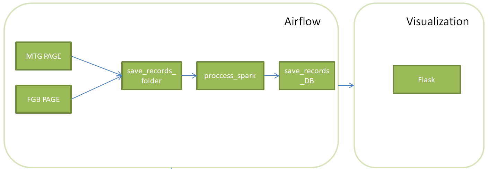

# CheckFiguresPrices

CheckFiguresPrices application gather information about figures products prices from two websites, process them and save in database.
Flask Application present basic statistics about products like max, min, avg price from all available records. 

# Table of Contents</h1>

 - [Intallation](#installation) 
 - [Explanation](#explanation) 
 - [Notes](#notes) 

## Intallation
---
    1. Download Docker.
    2. Download github project.
    3. Go to src folder of the project and run docker-compose file:
    docker compose -p figures_prices up -d
    [Note] To run pipeline user needs to go to airflow and shift slicer.
## Explanation
---
The application is built of 6 services:
- Airflow
- Spark master
- Spark worker
- PostgreSQL database
- PgAdmin
- Flask Application

Data is taken from 2 websites by python BeautifulSoup module. Then the data is processed by PySpark script and loaded to database. The data is presented in Flask Application.  

  
## Notes
---

Default credentials:  

Airflow:
- login: Admin
- password: admin

Database:
- login: Airflow
- password: Airflow
